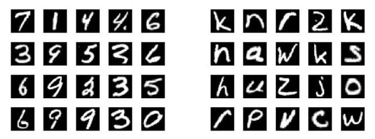

# Handwritten Character Tracing and Recognition Using Computer Vision



---

# Project Overview

This project is an interactive handwritten character tracing and recognition system built using **Computer Vision** and **Deep Learning**. It allows users to trace characters on a digital canvas, recognizes the drawn character using a Convolutional Neural Network (CNN), evaluates how closely the drawing matches the target character, and provides instant visual feedback through a **Streamlit** web application.

The project combines deep learning with classical image processing techniques to deliver accurate character recognition and detailed tracing evaluation.

The system consists of two main components:

- **CNN Classifier:** Identifies the character drawn by the user.
- **Geometry Evaluation Engine:** Measures how accurately the traced character matches the expected template and highlights drawing mistakes.

The model supports recognition of **47 handwritten character classes**, including:

- Digits: (0–9)
- Uppercase letters: (A–Z)
- Lowercase letters: (a, b, d, e, f, g, h, n, q, r, t)

---

# Technologies Used

- Python 3.10+
- TensorFlow / Keras
- OpenCV
- NumPy
- Pandas
- Streamlit
- streamlit-drawable-canvas
- Matplotlib
- Seaborn
- Scikit-learn

---

# Dataset

The project uses the **EMNIST Balanced Dataset**, a benchmark dataset for handwritten character recognition.

### Dataset Statistics

- **131,600 total images**
- **47 balanced character classes**
- **2,800 images per class**
- **28 × 28 grayscale images**

Dataset:

https://www.kaggle.com/datasets/crawford/emnist

---

# Image Preprocessing

Before prediction, every drawing goes through several preprocessing steps to match the format used during training.

1. Convert the drawing to grayscale.
2. Invert the image so characters become white on a black background.
3. Apply Otsu thresholding to remove anti-aliasing artifacts.
4. Detect the character bounding box.
5. Crop the drawing.
6. Resize while preserving the aspect ratio.
7. Normalize pixel values to the range **0–1**.

### Model Input

| Parameter | Value |
|-----------|------|
| Image Size | 28 × 28 |
| Channels | 1 |
| Pixel Range | 0.0 – 1.0 |
| Input Shape | (1, 28, 28, 1) |

---

# Dataset Split

The dataset is divided into independent training, validation, and testing sets.

| Dataset | Images |
|---------|-------:|
| Training | 95,880 |
| Validation | 16,920 |
| Testing | 18,800 |

---

# Model Comparison

Three CNN architectures were developed and evaluated.

## 1. Shallow CNN

A lightweight baseline network used for comparison.

## 2. Deep Regularized CNN

A deeper architecture incorporating:

- Batch Normalization
- Dropout
- Multiple convolutional layers

This architecture achieved the highest performance and was selected as the final production model.

## 3. Residual CNN

A residual network using shortcut connections to preserve spatial information across deeper layers.

---

# Training Configuration

| Parameter | Value |
|-----------|------|
| Loss Function | Sparse Categorical Crossentropy |
| Optimizer | Adam |
| Learning Rate | 0.001 |
| Batch Size | 128 |
| Epochs | 20 |

---

# Model Performance

| Model | Test Accuracy | Macro Precision | Macro F1 Score |
|------|---------------:|----------------:|---------------:|
| Shallow CNN | 82.1% | 0.814 | 0.817 |
| Deep Regularized CNN | **88.4%** | **0.881** | **0.882** |
| Residual CNN | 86.9% | 0.865 | 0.866 |

The final model was further evaluated using:

- Precision
- Recall
- F1-Score
- Confusion Matrix
- Per-class performance analysis

---

# Streamlit Application

The project includes an interactive Streamlit application for real-time tracing evaluation.

### Features

- Interactive drawing canvas
- Character selection
- Real-time handwriting recognition
- Confidence prediction
- IoU-based tracing score
- Visual error highlighting
- Kid-friendly interface

Run the application:

```bash
streamlit run app.py
```

---

# Saved Model

The best-performing model is exported after training as:

```
best_tracing_model.keras
```

The Streamlit application loads this model for real-time predictions.

---

# Applications

This project can be used in a variety of educational and computer vision applications, including:

- Handwriting learning platforms
- Character tracing games
- Educational applications for children
- Fine motor skill training
- Digital handwriting assessment
- Calligraphy practice systems
- Signature consistency verification

---

# Results

This project demonstrates how deep learning and classical computer vision techniques can be combined to build an intelligent handwriting tracing system.

The **Deep Regularized CNN** achieved **88.4% test accuracy** on the **47-class EMNIST Balanced Dataset**, while the geometry evaluation engine provides localized visual feedback to help users improve their handwriting accuracy.

The result is a complete interactive tracing application capable of recognizing handwritten characters, measuring tracing quality, and delivering immediate educational feedback in a user-friendly interface.
